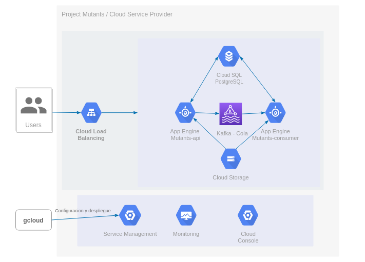
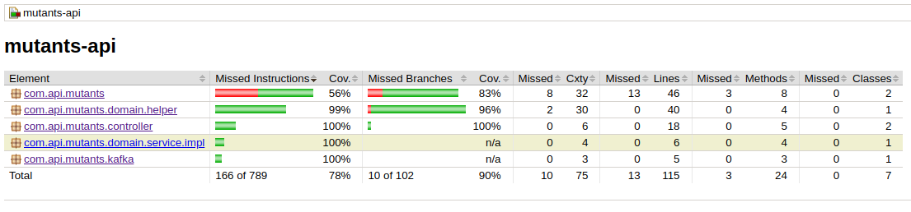

# ADN MUTANTE DETECTOR - MELI

## Objetivo
EL proyecto se desarrollo con el fin de detectar si un humano es mutante basándose en su secuencia de ADN, verificando la estructura de las subsecuencias con respecto a sus bases nitrogenadas que la componen [ adenina (A), citosina (C), guanina (G) y timina (T)]

## Consideraciones

* La evaluación de ADN mutante consistirá en la búsqueda de 4 letras repetidas de forma consecutiva. Se compararan letras en forma horizontal, vertical y diagonal en un mismo ciclo iterativo que logre recorrer la matriz de NxN dada como parámetro. 
Cuando se finalice una iteración se revisara si el ADN corresponde al de un Mutante o no, para hacer mas eficiente la búsqueda sin necesidad de recorrer toda la matriz.

* Se omitirá la verificación de cadenas de ADN que no cumplan con las siguientes características:
    * La Matriz NxN que se genere partir de la cadena de ADN, si bien no debe ser cuadrada, debe tener como mínimo el numero de filas y columnas igual limite de caracteres repetidos a buscar, en este caso sera de 4 dicho limite.
    * Cada Secuencia de bases nitrogenadas no puede tener caracteres diferentes a (A,C, G o T).
    * Las secuencias deben tener la misma longitud.
    * No deben existir caracteres en blanco dentro de una secuencia.
    
* El sistema debe soportar incrementos súbitos de trafico y atender las peticiones simultaneas que se realicen sobre los endpoints de validación de ADN y consulta de estadísticas. 
* Se omitira almacenar cadenas de ADN repetidas para ahorrar recursos y tiempo de procesamiento.
* Se realizaran pruebas de cobertura en aquellos elemntos que involucren logica del negocio, integracion y persistencia. Aquellas clases o paquetes de entidades, utilitarios y auxiliares seran omitidos.
* Se utilizara la infrastructura cloud de Google, para delegar el manejo de flexibilidad y escalamiento de los servicios a desplegar junto con la base de datos.
* Se usaran frameworks y herramientas opensource para el desarrolo del proyecto.
* Se hara uso de una cuenta gratuita en Google Cloud Plataform para el despliegue del proyecto, lo que acarrea unas limitantes en lo referente al autoescalamiento de instancias, trafico y tiempo de uso de los recursos.

Arquitectura
---------------------------



La arquitectura de la aplicación, se diseño principalmente teniendo en cuenta dos atributos de calidad: la escalabilidad y el Rendimiento.

EL hacer uso de Google App Engine permite tener instancias en ambiente flexible, 
que administra los ciclos de vida de N instancias de una aplicación respondiendo al volumen
de tráfico en momento determinado. Aprovechando esto, se desplegó el proyecto `mutants-api` 
con una configuración de mínimo 1 instancia hasta 10 instancias como máximo.
 
El proyecto `mutants-api` expone los endpoints del api , y se encarga de analizar las cadenas de ADN enviadas via REST. 
Luego genera la información necesaria para ser guardada en la base de datos, y la enviá sobre un evento a Kafka.
 
 Se implemento la conexión a Kafka Confluence Cloud, para que actuara como Buffer y 
 encolara las peticiones de inserción hacia la Base de datos. 
 Esto permite manejar una gran cantidad de peticiones HTTP por parte del proyecto `mutants-api`, 
 sin que este sature la BD (si existiera una conexión sincronica) y evitando al mismo tiempo el mantener muchas conexiones Http abiertas, 
 obligando a generar un escalamiento de instancias enorme que impactaría a los recursos fisicos disponibles.

El proyecto `mutants-consumer` se encarga de recibir los eventos encolados en Kafka , 
transforma la información relacionada al ADN analizado y finalmente realiza el proceso de persistencia.
Se configuro de tal forma que exista 1 instancia activa y máximo 2. 

Se selecciono una PostgreSQl por facilidad de uso, pero no tiene implicaciones el que sea relacional. 
Una mejora en velocidad de respuesta puede verse con la implementación de una BD NoSQL.

Google App Engine permite desplegar y configurar las aplicaciones como las de Spring Boot de forma sencilla. 
Mediante la herramienta **gcloud** se podía realizar el despliegue en tiempo real, es decir que, tan pronto como se
implementaba un cambio en el código, se genera una nueva versión de la aplicación la cual es almacenado en Google Cloud Storage  y se despliega una instancia de Google APp Engine.

Por otro lado, Kafka Cloud y SQL Cloud permiten trabajar desde la maquina local  
con una conexión directa hacia la nube, facilitando la configuración de conexiones, desarrollo y pruebas.


## Environment

* [Java8](http://www.oracle.com/technetwork/java/javase/overview/java8-2100321.html)
* [IDE IntelliJ IDEA](https://www.jetbrains.com/idea/)
* [Maven](https://maven.apache.org/)
* [Junit 5](https://junit.org/junit5/)
* [Spring Boot](https://spring.io/projects/spring-boot)
* [Flyway](https://flywaydb.org/documentation/usage/plugins/springboot.html)
* [Apache-Kafka](https://www.confluent.io/what-is-apache-kafka/)
* [GCP Cloud SQL - PostgreSQL](https://cloud.google.com/sql/docs/postgres?hl=es-419#docs)
* [GCP - App Engine](https://cloud.google.com/appengine)

## Instalación Local

**Clonar Repositorio**

Situarse en el directorio deseado y clonar el repositorio:

```bash
git clone https://github.com/davince8502/mutants-meli.git
```
ingresar a la carpeta del proyecto:

```bash
cd mutants-meli/mutants-api
```

**Importar Proyecto**

Importar el proyecto Maven al IDE de desarrollo deseado, ejemplo [IntelliJ IDEA](https://www.lagomframework.com/documentation/1.6.x/java/IntellijMaven.html).

**Compilar Proyecto**

para compilar el proyecto y descargar dependencias, ejecutar el siguiente comando en consola:

```bash
./mvnw clean compile
```

**Ejecutar pruebas de cobertura**

Ejecutar las pruebas con el siguiente comando

```bash
 ./mvnw clean test
```
Revisar el resultado de las pruebas abriendo el reporte resultante en el navegador web

```bash
 ../mutants-meli/mutants-api/target/site/jacoco/index.html
```



Configurar y Ejecutar Kafka
---------------------------

**Descargar Kafka**

[Descargar](https://downloads.apache.org/kafka/2.8.0/kafka_2.13-2.8.0.tgz) la última versión de Kafka y extraerla

```bash
 $ tar -xzf kafka_2.13-2.8.0.tgz
 $ cd kafka_2.13-2.8.0
```

**Iniciar Kafka**

Ejecute los siguientes comandos para iniciar todos los servicios en el orden correcto:
```bash
 # Start the ZooKeeper service
 # Note: Soon, ZooKeeper will no longer be required by Apache Kafka.
 $ bin/zookeeper-server-start.sh config/zookeeper.properties
```

Abra otra sesión de terminal y ejecute:

```bash
# Start the Kafka broker service
$ bin/kafka-server-start.sh config/server.properties
```

Esperar que suban todos los servicios.


**Crear Topico**

Antes de generar los primeros eventos, se debe crear un Topico. Abrir otra sesión de terminal y ejecutar:

```bash
$ bin/kafka-topics.sh --create --topic mutants --bootstrap-server localhost:9092
```

Verificar Topico

```bash
$ bin/kafka-topics.sh --describe --topic mutants --bootstrap-server localhost:9092
Topic:quickstart-events  PartitionCount:1    ReplicationFactor:1 Configs:
    Topic: quickstart-events Partition: 0    Leader: 0   Replicas: 0 Isr: 0
```


Configurar Proyectos
---------------------------

**Editar archivos de propiedades Proyecto Mutants-API**

Editar el archivo de propiedades: `mutants-api/src/main/resources/application.properties`

Comentariar con `#` **TODAS** las propiedades relacionadas a Kafka ubicado en Google Cloud:

```bash
spring.kafka.properties.sasl.mechanism=PLAIN....
spring.kafka.properties.bootstrap.servers=pkc-lzvrd....
spring.kafka.properties.sasl.jaas.config=org.apache....
spring.kafka.properties.security.protocol=SASL_SSL....
spring.kafka.producer.bootstrap-servers= pkc-lzvrd.....
spring.kafka.producer.key-serializer= org.apache.ka....
spring.kafka.producer.value-serializer= org.apache.....
```

Editar el archivo de propiedades: `mutants-api/src/main/resources/application.yml`

Agregar las propiedades de Kafka Local

```bash
spring:
 .
 .
 .
 .
 .
  kafka:
    consumer:
      bootstrap-servers: localhost:9092
      group-id: group_id
      auto-offset-reset: earliest
      key-deserializer: org.apache.kafka.common.serialization.StringDeserializer
      value-deserializer: org.apache.kafka.common.serialization.StringDeserializer
    producer:
      bootstrap-servers: localhost:9092
      key-serializer: org.apache.kafka.common.serialization.StringSerializer
      value-serializer: org.apache.kafka.common.serialization.StringSerializer

```


**Editar archivos de propiedades Proyecto Mutants-Consumer**

Editar el archivo de propiedades: `mutants-consumer/src/main/resources/application.properties`

Comentariar con `#` **TODAS** las propiedades relacionadas a Kafka ubicado en Google Cloud:

```bash
spring.kafka.properties.sasl.mechanism=PLAIN....
spring.kafka.properties.bootstrap.servers=pkc-lzvrd....
spring.kafka.properties.sasl.jaas.config=org.apache....
spring.kafka.properties.security.protocol=SASL_SSL....
spring.kafka.producer.bootstrap-servers= pkc-lzvrd.....
spring.kafka.producer.key-serializer= org.apache.ka....
spring.kafka.producer.value-serializer= org.apache.....
```

Editar el archivo de propiedades: `mutants-consumer/src/main/resources/application.yml`

Agregar las propiedades de Kafka Local y el **puerto : 8091**

```bash
server:
  port: 8091

spring:
 .
 .
 .
 .
 .
  kafka:
    consumer:
      bootstrap-servers: localhost:9092
      group-id: group_id
      auto-offset-reset: earliest
      key-deserializer: org.apache.kafka.common.serialization.StringDeserializer
      value-deserializer: org.apache.kafka.common.serialization.StringDeserializer
    producer:
      bootstrap-servers: localhost:9092
      key-serializer: org.apache.kafka.common.serialization.StringSerializer
      value-serializer: org.apache.kafka.common.serialization.StringSerializer

```


## Ejecutar aplicación Mutants - API 

Inicar la aplicacion Spring boot con el siguente comando

```bash
 ./mvnw spring-boot:run -Dmaven.test.skip=true
```


## Ejecutar aplicación Mutants - Consumer

ingresar a la carpeta del proyecto:

```bash
cd mutants-meli/mutants-consumer
```

**Importar Proyecto**

Importar el proyecto Maven al IDE de desarrollo deseado, ejemplo [IntelliJ IDEA](https://www.lagomframework.com/documentation/1.6.x/java/IntellijMaven.html).

**Compilar Proyecto**

para compilar el proyecto y descargar dependencias, ejecutar el siguiente comando en consola:

```bash
./mvnw clean compile
```

Inicar la aplicacion Spring boot con el siguiente comando

```bash
 ./mvnw spring-boot:run -Dmaven.test.skip=true
```

Configurar Base Datos
---------------------------
Los proyectos `mutants-api` y `mutants-consumer` estan cofigurados para conectarse con una base de datos PostgreSQL ubicada en Google Cloud

Si desea realizar una configuración local, modificar el archivo `src/main/resources/application.yml` en cada proyecto modificando las propiedades de conexión.

```bash
spring:
  datasource:
    url: jdbc:postgresql://.....
    username: user...
    password: clave...
```


Probar Servicios REST - Ambiente Local
-------------------------------------

Mediante un cliente de servicios como [Postman](https://www.postman.com/), importar los comandos de linea CURL para cada servicio:

### Validar ADN Mutante

El servicio evalua si el ADN ingresado corresponde a un mutante o a un humano.
* Si corresponde a un mutante devuelve un Status 200 OK
* Si corresponde a un humano devuelve un Status 403 Forbidden

**Petición**

```shell
curl --location --request POST 'http://localhost:8080/api/mutant' \
--header 'Content-Type: application/json' \
--data-raw '{
    "dna":["ATGCGA","CAGTGC","TTATGT","AGAAGG","CCCCTA","TCACTG"] 
}'
```

**Respuesta**
```shell
{
    "status": {
        "code": 200,
        "message": "Is Mutant"
    }
}
```

Se obtiene el resultado de la validación del ADN, con un código de HttpStatus `200`.

Se devuelve un objeto llamado `status` que contiene el código de la respuesta `code` 
y un mensaje con la descripción del resultado.


### Consultar Estadisticas

Servicio que consulta las estadísticas de las verificaciones de ADN

**Petición**

```shell
curl --location --request GET 'http://localhost:8080/api/stats'
```

**Respuesta**
```shell
{
    "countMutantDna": 6,
    "countHumanDna": 4,
    "ratio": 1.5
}
```

Se obtiene las estadísticas de forma exitosa con un código de HttpStatus `200`.

### Ver Documentación Servicios

Copiar la siguiente URL en el navegador para visualizar la documentación generada para cada Servicio Web

```shell
http://localhost:8080/swagger-ui-custom.html
```

Probar Servicios REST - Cloud
-------------------------------------

Se desplegaron los MS mediante la herramienta gcloud en la plataforma de Google App Engine.

### Validar ADN Mutante

**Petición**

URL: https://muntants-api-dot-noted-handler-320318.rj.r.appspot.com/api/mutant

Tipo: POST

```shell
curl --location --request POST 'https://muntants-api-dot-noted-handler-320318.rj.r.appspot.com/api/mutant' \
--header 'Content-Type: application/json' \
--data-raw '{
    "dna":["ATGCGA","CAGTGC","TTATGT","AGAAGG","CCCCTA","TCACTG"] 
}'
```

**Respuesta**
```shell
{
    "status": {
        "code": 200,
        "message": "Is Mutant"
    }
}
```

Se obtiene el resultado de la validación del ADN, con un código de HttpStatus `200`, lo que indica que el ADN analizado corresponde a Mutante.


### Consultar Estadisticas

Servicio que consulta las estadísticas de las verificaciones de ADN

**Petición**


URL: https://muntants-api-dot-noted-handler-320318.rj.r.appspot.com/api/stats

Tipo: GET


```shell
curl --location --request GET 'https://muntants-api-dot-noted-handler-320318.rj.r.appspot.com/api/stats'
```

**Respuesta**
```shell
{
    "countMutantDna": 6,
    "countHumanDna": 4,
    "ratio": 1.5
}
```

Se obtiene las estadísticas de forma exitosa con un código de HttpStatus `200`.
